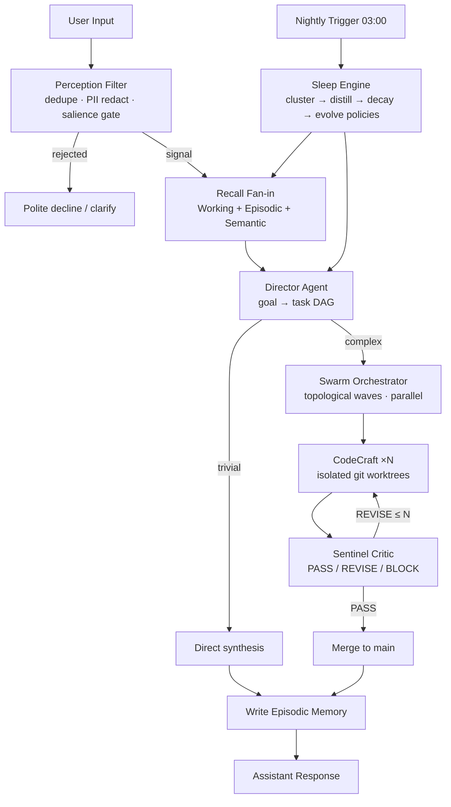
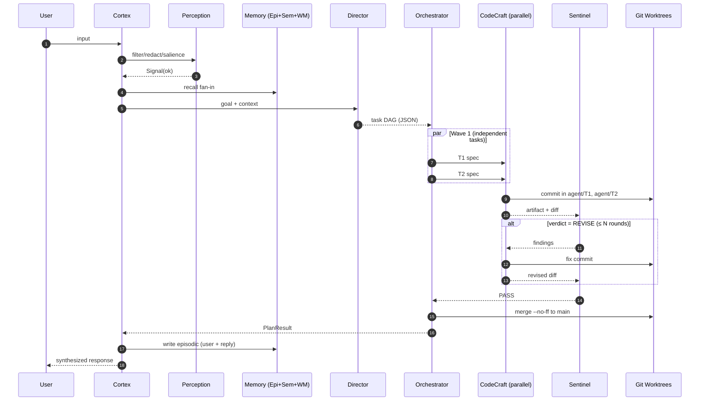

# Self-Evolving Cognitive Multi-Agent Swarm & Long-Context Architecture
- **Pillar**: Pillar 4: Advanced Multi-Agent & Cognitive Architecture
- **Generated Date**: 2026-08-23 11:14:01
- **Synthesized By**: 0x Alpha (stealth/ox-alpha) via Antigravity 2.0

---

# CORTEX — A Self-Evolving Cognitive AI Assistant

**Blueprint & Reference Implementation · Autonomous Multi-Agent Systems / Brain-Inspired Cognitive Architectures**

---

## 0. Design Principles

| Principle | Implementation Consequence |
|---|---|
| **Modularity over monolith** | Each cognitive faculty is an isolated, independently testable module with a narrow interface |
| **Two-loop cognition** | Fast reactive loop (perceive→recall→answer) + slow evolutionary loop (nightly consolidation/self-modification) |
| **Everything is a memory write** | Every interaction enriches episodic memory; every night enriches semantic memory |
| **Fail-closed criticism** | Unparsable critic output = REVISE, never silent PASS |
| **Isolation by default** | Every agent mutates state only in its own branch workspace |
| **Graceful degradation** | Every LLM call is routable, retried, circuit-broken, and budget-capped |

---

## 1. System Architecture

```
┌─────────────────────────────────────────────────────────────────────────────┐
│                              CORTEX COGNITIVE STACK                         │
│                                                                             │
│   ┌──────────────────┐     ┌──────────────────────────────────────────┐    │
│   │ S1 PERCEPTION    │────▶│ S2 WORKING MEMORY (tiered, 1M-capable)   │    │
│   │ noise filter     │     │  PINNED(system/goal) + WARM(summary)     │    │
│   │ PII redaction    │     │  + HOT(verbatim turns, LLM-compacted)    │    │
│   │ salience gate    │     └───────────────▲──────────────────────────┘    │
│   └────────┬─────────┘                     │ snapshot()                   │
│            ▼                               │                               │
│   ┌──────────────────┐            ┌────────┴───────────────────────────┐   │
│   │ S3a EPISODIC MEM │◀──write──  │ S4 EXECUTIVE PLANNING + CRITICS    │   │
│   │ SQLite event log │            │  DIRECTOR ─▶ DAG decomposition     │   │
│   │ recency×import×  │            │  CODECRAFT ─▶ parallel builders    │   │
│   │ relevance blend  │            │  SENTINEL ─▶ adversarial review    │   │
│   └────────┬─────────┘            └────────┬───────────────────────────┘   │
│            │ consolidate                    │ git-worktree isolation        │
│            ▼                               ▼                               │
│   ┌──────────────────┐            ┌────────────────────────────────────┐   │
│   │ S5 SLEEP ENGINE  │            │ S3b SEMANTIC RAG STORE             │   │
│   │ nightly cluster→ │───distill─▶│ SQLite FTS5 (BM25) + hybrid rerank │   │
│   │ distill→decay→   │            │ facts / lessons / distilled docs   │   │
│   │ evolve POLICIES  │            └────────────────────────────────────┘   │
│   └──────────────────┘                                                     │
│                                                                             │
│   INFRA: Model Router (multi-provider, circuit-breakers, budget guard)      │
│          Agent Bus (non-blocking pub/sub) · Workspace Manager (git)         │
└─────────────────────────────────────────────────────────────────────────────┘
```

**Cognitive cycle (mermaid):**



---

## 2. Repository Layout

```
cortex/
├── pyproject.toml
├── cortex/
│   ├── __init__.py
│   ├── config.py                  # Settings (env-driven)
│   ├── common.py                  # tokens, embeddings, JSON repair, sqlite factory
│   ├── router.py                  # ★ Model Router
│   ├── perception.py              # S1 Sensory & Perception Filter
│   ├── memory/
│   │   ├── __init__.py
│   │   ├── working.py             # S2 Working Memory
│   │   ├── episodic.py            # S3a Episodic Experience Memory
│   │   ├── semantic.py            # ★ S3b SQLite FTS5 Semantic RAG
│   │   └── consolidation.py       # ★ S5 Sleep / Consolidation Engine
│   ├── swarm/
│   │   ├── __init__.py
│   │   ├── bus.py                 # non-blocking pub/sub fabric
│   │   ├── workspace.py           # isolated git-worktree branches
│   │   ├── agents.py              # Director / CodeCraft / Sentinel
│   │   └── orchestrator.py        # parallel DAG execution + critic loop
│   ├── core.py                    # Cortex assembly & turn pipeline
│   └── consolidate.py             # CLI entrypoint for nightly job
└── tests/
    ├── test_semantic_rag.py
    └── test_router_fallback.py
```

Dependencies: `httpx`, `numpy`, `tiktoken` (optional), stdlib otherwise.

---

## 3. Foundation — Config & Common Utilities

```python
# cortex/config.py
from __future__ import annotations
import os
from dataclasses import dataclass, field


def _env(k: str, d: str) -> str:
    return os.getenv(k, d)


@dataclass(frozen=True)
class Settings:
    db_path: str = field(default_factory=lambda: _env("CORTEX_DB", "./cortex.db"))
    repo_root: str = field(default_factory=lambda: _env("CORTEX_REPO", "."))
    workspace_root: str = field(default_factory=lambda: _env("CORTEX_WORKSPACES", "./.workspaces"))

    working_budget_tokens: int = int(_env("CORTEX_WM_BUDGET", "120000"))
    perception_gate: float = float(_env("CORTEX_GATE", "0.18"))
    daily_budget_usd: float = float(_env("CORTEX_DAILY_BUDGET_USD", "25.0"))

    consolidate_after_h: int = int(_env("CORTEX_CONSOLIDATE_AFTER_H", "20"))
    cluster_theta: float = float(_env("CORTEX_CLUSTER_THETA", "0.62"))
    decay_half_life_d: float = float(_env("CORTEX_DECAY_HALF_LIFE_D", "21"))
    revision_rounds: int = int(_env("CORTEX_REVISION_ROUNDS", "2"))
```

```python
# cortex/common.py
from __future__ import annotations
import hashlib, json, logging, re, sqlite3
from datetime import datetime, timezone
from typing import Any

import numpy as np

log = logging.getLogger("cortex")


def utcnow() -> datetime:
    return datetime.now(timezone.utc)


def iso(dt: datetime | None = None) -> str:
    return (dt or utcnow()).isoformat()


# ---------- token counting ----------
try:
    import tiktoken
    _ENC = tiktoken.get_encoding("cl100k_base")

    def count_tokens(text: str) -> int:
        try:
            return len(_ENC.encode(text or ""))
        except Exception:
            return max(1, len(text or "") // 4)
except ImportError:                                    # graceful offline fallback
    def count_tokens(text: str) -> int:
        return max(1, len(text or "") // 4)


# ---------- embeddings (pluggable; deterministic offline default) ----------
EMBED_DIM = 384


def embed_hash(text: str) -> np.ndarray:
    """Feature-hashing embedder. Swap for a neural embedder in production —
    every consumer only relies on fixed-dim, L2-normalized float32 vectors."""
    v = np.zeros(EMBED_DIM, dtype=np.float32)
    for tok in re.findall(r"[a-z0-9]{2,}", (text or "").lower()):
        h = hashlib.blake2b(tok.encode(), digest_size=8).digest()
        v[int.from_bytes(h[:4], "big") % EMBED_DIM] += 1.0 if h[4] & 1 else -1.0
    n = float(np.linalg.norm(v)) or 1.0
    return v / n


def cos(a: np.ndarray, b: np.ndarray) -> float:
    na, nb = float(np.linalg.norm(a)), float(np.linalg.norm(b))
    return 0.0 if na == 0 or nb == 0 else float(np.dot(a, b) / (na * nb))


def pack_vec(v: np.ndarray) -> bytes:
    return np.asarray(v, dtype=np.float32).tobytes()


def unpack_vec(blob: bytes | None) -> np.ndarray | None:
    return np.frombuffer(blob, dtype=np.float32) if blob else None


# ---------- LLM JSON repair ----------
def json_safe_loads(text: str) -> Any:
    """Extract the first balanced JSON object/array from noisy model output."""
    if not text:
        return None
    text = re.sub(r"^```(?:json)?|```$", "", text.strip(), flags=re.M).strip()
    for opener, closer in (("{", "}"), ("[", "]")):
        start = text.find(opener)
        if start < 0:
            continue
        depth = 0
        for i in range(start, len(text)):
            if text[i] == opener:
                depth += 1
            elif text[i] == closer:
                depth -= 1
                if depth == 0:
                    try:
                        return json.loads(text[start:i + 1])
                    except json.JSONDecodeError:
                        break
    return None


# ---------- sqlite factory ----------
def connect_db(path: str) -> sqlite3.Connection:
    con = sqlite3.connect(path, check_same_thread=False)
    con.execute("PRAGMA journal_mode=WAL")       # concurrent readers during writes
    con.execute("PRAGMA synchronous=NORMAL")     # durable-enough, fast
    con.execute("PRAGMA foreign_keys=ON")
    con.execute("PRAGMA busy_timeout=5000")
    return con
```

---

## 4. ★ The Model Router

**Design:** capability/context-tier aware candidate ranking → per-endpoint circuit breakers → jittered exponential-backoff retries on transient faults only → hard daily USD budget guard → provider-agnostic HTTP adapters (OpenAI-compatible, Anthropic Messages, Gemini `generateContent`) over a single `httpx.AsyncClient` (mockable in tests).

| Tier | Routed to (example registry) | Used by |
|---|---|---|
| `LONG_CONTEXT` | `ox-alpha-long` (1M ctx), `gemini-long` (1M ctx) | Working-memory compaction, giant recalls |
| `REASONING` | frontier reasoning model | Director planning, Sentinel deep review |
| `FAST` | small fast model, local vLLM/Ollama | Perception assists, summaries, cheap critics |

```python
# cortex/router.py
"""Capability-aware, cost-capped model router with circuit breakers."""
from __future__ import annotations

import asyncio, logging, random, time
from collections import defaultdict
from dataclasses import dataclass, field
from datetime import datetime, timezone
from enum import Enum
from typing import Optional

import httpx

from .common import count_tokens

log = logging.getLogger("cortex.router")


class RouterError(RuntimeError): ...
class BudgetExceeded(RouterError): ...
class AllProvidersFailed(RouterError): ...


class Tier(str, Enum):
    FAST = "fast"
    BALANCED = "balanced"
    LONG_CONTEXT = "long_context"
    REASONING = "reasoning"


# ----------------------------- contracts -----------------------------

@dataclass(frozen=True)
class ModelCard:
    key: str                       # unique registry key
    provider: str                  # "openai_compat" | "anthropic" | "gemini"
    model: str                     # provider-side model id
    ctx: int                       # context window, tokens
    tier: Tier
    in_per_mtok: float             # USD per 1M input tokens (illustrative)
    out_per_mtok: float
    base_url: str = ""             # required for openai_compat
    capabilities: frozenset = frozenset()


@dataclass
class ChatMessage:
    role: str                      # "user" | "assistant"
    content: str


@dataclass
class CompletionRequest:
    messages: list[ChatMessage]
    system: str | None = None
    max_tokens: int = 1024
    temperature: float = 0.2
    json_mode: bool = False
    min_ctx: int = 0               # minimum context window required
    tier: Tier | None = None       # soft preference
    timeout_s: float = 90.0


@dataclass
class Completion:
    text: str
    card_key: str
    model: str
    tokens_in: int
    tokens_out: int
    cost_usd: float
    latency_ms: float


# --------------------------- example registry ---------------------------
# Values are illustrative configuration — override via ModelRouter.register().

REGISTRY: tuple[ModelCard, ...] = (
    ModelCard("ox-alpha-long", "openai_compat", "ox-alpha-long",
              1_000_000, Tier.LONG_CONTEXT, 1.25, 5.00,
              base_url="${OXALPHA_BASE_URL}"),
    ModelCard("gemini-long", "gemini", "models/gemini-2.5-pro-preview",
              1_000_000, Tier.LONG_CONTEXT, 1.25, 10.00),
    ModelCard("frontier-reasoner", "anthropic", "claude-sonnet-4-5",
              200_000, Tier.REASONING, 3.00, 15.00),
    ModelCard("swift-mini", "openai_compat", "gpt-4o-mini",
              128_000, Tier.FAST, 0.15, 0.60,
              base_url="https://api.openai.com/v1"),
    ModelCard("local-qwen", "openai_compat", "qwen2.5:14b",
              32_000, Tier.FAST, 0.0, 0.0,
              base_url="http://localhost:11434/v1"),
)


# ------------------------- circuit breaker -------------------------

class Breaker:
    """CLOSED → (threshold failures) → OPEN → (cooldown) → HALF_OPEN → probe."""

    def __init__(self, threshold: int = 5, cooldown_s: float = 30.0):
        self.threshold, self.cooldown = threshold, cooldown_s
        self.failures = 0
        self.opened_at: float | None = None

    def allow(self) -> bool:
        if self.opened_at is None:
            return True
        if time.monotonic() - self.opened_at >= self.cooldown:
            return True                      # HALF_OPEN probe
        return False

    def record(self, ok: bool) -> None:
        if ok:
            self.failures, self.opened_at = 0, None
        else:
            self.failures += 1
            if self.failures >= self.threshold:
                self.opened_at = time.monotonic()
                log.warning("breaker OPEN after %d failures", self.failures)


# ------------------------ provider adapters ------------------------
# Each adapter: build(url/headers/payload) and parse(body) -> (text, t_in, t_out)

def _openai_build(card: ModelCard, req: CompletionRequest, key: str | None):
    url = f"{card.base_url.rstrip('/')}/chat/completions"
    headers = {"Authorization": f"Bearer {key}"} if key else {}
    messages = ([{"role": "system", "content": req.system}] if req.system else []) + \
               [{"role": m.role, "content": m.content} for m in req.messages]
    payload: dict = {"model": card.model, "messages": messages,
                     "temperature": req.temperature, "max_tokens": req.max_tokens}
    if req.json_mode:
        payload["response_format"] = {"type": "json_object"}
    return url, headers, payload


def _openai_parse(body: dict):
    ch = body["choices"][0]["message"]
    u = body.get("usage", {})
    return ch.get("content") or "", u.get("prompt_tokens", 0), u.get("completion_tokens", 0)


def _anthropic_build(card: ModelCard, req: CompletionRequest, key: str | None):
    url = "https://api.anthropic.com/v1/messages"
    headers = {"x-api-key": key or "", "anthropic-version": "2023-06-01"}
    msgs = [{"role": m.role, "content": m.content} for m in req.messages]
    payload: dict = {"model": card.model, "max_tokens": req.max_tokens,
                     "temperature": req.temperature, "messages": msgs}
    if req.system:
        payload["system"] = req.system
    return url, headers, payload


def _anthropic_parse(body: dict):
    text = "".join(b.get("text", "") for b in body.get("content", []))
    u = body.get("usage", {})
    return text, u.get("input_tokens", 0), u.get("output_tokens", 0)


def _gemini_build(card: ModelCard, req: CompletionRequest, key: str | None):
    model = card.model.split("/")[-1]
    url = f"https://generativelanguage.googleapis.com/v1beta/models/{model}:generateContent"
    headers = {"x-goog-api-key": key or ""}
    contents = [{"role": "model" if m.role == "assistant" else "user",
                 "parts": [{"text": m.content}]} for m in req.messages]
    payload: dict = {"contents": contents,
                     "generationConfig": {"temperature": req.temperature,
                                          "maxOutputTokens": req.max_tokens}}
    if req.system:
        payload["systemInstruction"] = {"parts": [{"text": req.system}]}
    if req.json_mode:
        payload["generationConfig"]["responseMimeType"] = "application/json"
    return url, headers, payload


def _gemini_parse(body: dict):
    cand = (body.get("candidates") or [{}])[0]
    text = "".join(p.get("text", "") for p in cand.get("content", {}).get("parts", []))
    u = body.get("usageMetadata", {})
    return text, u.get("promptTokenCount", 0), u.get("candidatesTokenCount", 0)


_ADAPTERS = {
    "openai_compat": (_openai_build, _openai_parse),
    "anthropic": (_anthropic_build, _anthropic_parse),
    "gemini": (_gemini_build, _gemini_parse),
}


# ------------------------------ router ------------------------------

class ModelRouter:
    RETRYABLE_STATUS = {429, 500, 502, 503, 504}

    def __init__(self, cards: tuple[ModelCard, ...] = REGISTRY,
                 daily_budget_usd: float = 25.0,
                 api_keys: dict[str, str | None] | None = None,
                 client: httpx.AsyncClient | None = None):
        self.cards: list[ModelCard] = list(cards)
        self.by_key = {c.key: c for c in self.cards}
        self.breakers = {c.key: Breaker() for c in self.cards}
        self.daily_budget = daily_budget_usd
        self.keys = api_keys or {}
        self._spend: dict[str, float] = defaultdict(float)   # YYYY-MM-DD -> USD
        self.client = client or httpx.AsyncClient(
            timeout=httpx.Timeout(connect=10.0, read=120.0, write=30.0, pool=10.0))

    def register(self, card: ModelCard) -> None:
        self.cards.append(card)
        self.by_key[card.key] = card
        self.breakers.setdefault(card.key, Breaker())

    # ---- candidate ranking ----
    def _candidates(self, req: CompletionRequest) -> list[ModelCard]:
        prompt_tokens = count_tokens(req.system or "") + \
            sum(count_tokens(m.content) for m in req.messages)
        need = max(req.min_ctx, prompt_tokens + req.max_tokens)
        pool = [c for c in self.cards if c.ctx >= need]
        if not pool:
            raise RouterError(f"no model fits context requirement ({need} tok)")
        pool.sort(key=lambda c: (
            0 if (req.tier and c.tier == req.tier) else 1,   # tier preference
            0 if c.out_per_mtok == 0 else 1,                 # free local first on ties
            c.in_per_mtok + c.out_per_mtok,                  # then cheapest
        ))
        return pool

    # ---- budget ----
    def _today(self) -> str:
        return datetime.now(timezone.utc).strftime("%Y-%m-%d")

    def spend_today(self) -> float:
        return self._spend[self._today()]

    # ---- invocation ----
    async def complete(self, req: CompletionRequest) -> Completion:
        est = (count_tokens(req.system or "") +
               sum(count_tokens(m.content) for m in req.messages) + req.max_tokens)
        if self.spend_today() > self.daily_budget:
            raise BudgetExceeded(f"daily budget ${self.daily_budget:.2f} exhausted")

        errors: list[str] = []
        for card in self._candidates(req):
            br = self.breakers[card.key]
            if not br.allow():
                errors.append(f"{card.key}: breaker open")
                continue
            for attempt in range(3):
                try:
                    comp = await self._invoke(card, req)
                    br.record(True)
                    self._spend[self._today()] += comp.cost_usd
                    return comp
                except _Transient as e:
                    br.record(False)
                    delay = 0.6 * (2 ** attempt) + random.uniform(0, 0.4)
                    log.warning("%s transient (%s); retry in %.1fs", card.key, e, delay)
                    await asyncio.sleep(delay)
                except Exception as e:                    # permanent → next provider
                    br.record(False)
                    errors.append(f"{card.key}: {e}")
                    break
        raise AllProvidersFailed("; ".join(errors) or "no candidates available")

    async def _invoke(self, card: ModelCard, req: CompletionRequest) -> Completion:
        build, parse = _ADAPTERS[card.provider]
        key_env = {"openai_compat": "OPENAI_API_KEY", "anthropic": "ANTHROPIC_API_KEY",
                   "gemini": "GEMINI_API_KEY"}.get(card.provider)
        if card.key == "ox-alpha-long":
            key_env = "OXALPHA_API_KEY"
        key = self.keys.get(key_env) if self.keys else None
        url, headers, payload = build(card, req, key)

        t0 = time.monotonic()
        try:
            resp = await self.client.post(url, json=payload, headers=headers,
                                          timeout=req.timeout_s)
        except (httpx.TimeoutException, httpx.TransportError) as e:
            raise _Transient(str(e)) from e
        if resp.status_code in self.RETRYABLE_STATUS:
            raise _Transient(f"http {resp.status_code}")
        if resp.status_code >= 400:
            raise RouterError(f"{card.key} http {resp.status_code}: {resp.text[:200]}")

        text, t_in, t_out = parse(resp.json())
        cost = t_in / 1e6 * card.in_per_mtok + t_out / 1e6 * card.out_per_mtok
        return Completion(text=text, card_key=card.key, model=card.model,
                          tokens_in=t_in, tokens_out=t_out, cost_usd=round(cost, 6),
                          latency_ms=(time.monotonic() - t0) * 1000)

    async def aclose(self) -> None:
        await self.client.aclose()


class _Transient(Exception):
    """Internal marker: worth retrying on the same provider."""
```

---

## 5. S1 — Sensory & Perception Filter

**Pipeline:** `normalize → boilerplate strip → PII redaction → dedupe (sha256 LRU) → entity/intent extraction → salience scoring → gate`.

Salience = weighted mix of *interrogative*, *imperative*, *information density*, and *novelty* (cosine distance against the recent-input ring buffer). Below-gate input is refused before any expensive cognition runs.

```python
# cortex/perception.py
"""Sensory filtering: noise removal, high-signal extraction, salience gating."""
from __future__ import annotations

import hashlib, re
from collections import OrderedDict, deque
from dataclasses import dataclass, field

from .common import cos, embed_hash

PII_PATTERNS: list[tuple[str, re.Pattern]] = [
    ("api_key", re.compile(r"\b(?:sk|pk|rk)-[A-Za-z0-9_-]{16,}\b")),
    ("bearer",  re.compile(r"\bBearer\s+[A-Za-z0-9._\-]{16,}\b", re.I)),
    ("email",   re.compile(r"[\w.+-]+@[\w-]+\.[\w.]{2,}")),
    ("cc",      re.compile(r"\b(?:\d[ -]?){13,16}\b")),
]
BOILERPLATE = re.compile(
    r"(?im)^.*?(unsubscribe|do not reply|confidentiality notice|all rights reserved).*$")
URL = re.compile(r"https?://\S+")
PROPER_NOUN = re.compile(r"\b[A-Z][a-z]{2,}(?:\s+[A-Z][a-z]{2,})?\b")
STOPWORDS = {"The", "This", "That", "Please", "Hello", "Thanks", "When", "What",
             "Where", "How", "Why", "Who", "Can", "Could", "Should", "Would", "There"}

IMPERATIVE = {"build", "create", "write", "fix", "refactor", "deploy", "implement",
              "analyze", "review", "design", "migrate", "optimize", "debug", "test"}

INTENT_RULES: list[tuple[str, re.Pattern]] = [
    ("CODE",   re.compile(r"```|\b(function|bug|traceback|stack\s?trace|compile|regex|api)\b", re.I)),
    ("TASK",   re.compile(r"\b(implement|refactor|deploy|migrate|set\s?up|pipeline)\b", re.I)),
    ("SEARCH", re.compile(r"\b(find|search|look\s?up|documentation|docs|where\s+is)\b", re.I)),
]


@dataclass
class Signal:
    ok: bool
    text: str
    score: float
    intent: str = "CHAT"
    entities: list[str] = field(default_factory=list)
    redactions: int = 0
    notes: list[str] = field(default_factory=list)


class PerceptionFilter:
    def __init__(self, gate: float = 0.18, embedder=embed_hash, history: int = 512):
        self.gate, self.embed = gate, embedder
        self._seen: OrderedDict[str, None] = OrderedDict()
        self._recent: deque = deque(maxlen=64)

    # ---- stage helpers -------------------------------------------------
    def _redact(self, text: str) -> tuple[str, int]:
        n = 0
        for kind, pat in PII_PATTERNS:
            text, k = pat.subn(f"[REDACTED:{kind}]", text)
            n += k
        return text, n

    def _is_duplicate(self, text: str) -> bool:
        h = hashlib.sha256(re.sub(r"\W+", "", text.lower()).encode()).hexdigest()
        if h in self._seen:
            self._seen.move_to_end(h)
            return True
        self._seen[h] = None
        if len(self._seen) > history_default(self):
            self._seen.popitem(last=False)
        return False

    def _extract(self, text: str) -> tuple[str, list[str]]:
        intent = next((name for name, rx in INTENT_RULES if rx.search(text)), "CHAT")
        ents = [w for w in PROPER_NOUN.findall(text) if w.split()[0] not in STOPWORDS]
        ents += URL.findall(text)
        return intent, list(dict.fromkeys(ents))[:16]

    def _salience(self, text: str, intent: str, novel: float) -> float:
        s = 0.0
        s += 0.30 if "?" in text else 0.0
        words = set(re.findall(r"[a-z]+", text.lower()))
        s += 0.30 * min(1.0, len(words & IMPERATIVE) / 2)
        s += 0.20 * min(1.0, len(text) / 400)
        s += 0.20 * novel
        if intent in ("CODE", "TASK"):
            s += 0.05
        return round(min(s, 1.0), 3)

    # ---- public API ----------------------------------------------------
    def process(self, text: str) -> Signal:
        text = BOILERPLATE.sub("", text or "")
        text = re.sub(r"[ \t]+", " ", text).strip()
        if len(text) < 3:
            return Signal(False, text, 0.0, notes=["empty"])

        text, redactions = self._redact(text)
        if self._is_duplicate(text):
            return Signal(False, text, 0.0, notes=["duplicate"])

        intent, entities = self._extract(text)
        vec = self.embed(text)
        novel = 1.0 - (max((cos(vec, r) for r in self._recent), default=0.0))
        self._recent.append(vec)

        score = self._salience(text, intent, novel)
        notes = []
        if redactions:
            notes.append(f"redacted {redactions}")
        if score < self.gate:
            notes.append(f"below gate {self.gate}")
        return Signal(score >= self.gate, text, score, intent, entities, redactions, notes)


def history_default(self: PerceptionFilter) -> int:
    return 512
```

---

## 6. Memory Subsystem

### 6.1 Tier table

| Tier | Medium | Contents | Eviction |
|---|---|---|---|
| **PINNED** | in-proc slots | system prompt, active goal, user profile | manual |
| **WARM** | rolling LLM summary | compressed history of evicted turns | folded forward on each compaction |
| **HOT** | verbatim deque | recent turns within token budget | LLM-compacted into WARM when over budget |

### 6.2 S2 — Working Memory (`memory/working.py`)

```python
# cortex/memory/working.py
"""Tiered working-memory buffer: pinned slots + rolling summary + hot verbatim turns."""
from __future__ import annotations

import time
from collections import deque
from dataclasses import dataclass

from ..common import count_tokens
from ..router import ChatMessage, CompletionRequest, ModelRouter


@dataclass
class Turn:
    role: str
    content: str
    tokens: int
    ts: float
    importance: float = 0.5


_COMPRESS_SYS = (
    "You compress conversation history. Preserve: decisions, commitments, "
    "file paths, numbers, unresolved questions. Be telegraphic. Max 250 words."
)


class WorkingMemory:
    def __init__(self, router: ModelRouter, budget: int = 120_000,
                 compress_model_tier=None):
        self.router = router
        self.budget = budget
        self.hot: deque[Turn] = deque()
        self.summary = ""
        self.pinned: dict[str, str] = {}

    # ---------------- pins ----------------
    def pin(self, key: str, value: str) -> None:
        self.pinned[key] = value

    def unpin(self, key: str) -> None:
        self.pinned.pop(key, None)

    # ---------------- writes ----------------
    async def push(self, role: str, content: str, importance: float = 0.5) -> None:
        self.hot.append(Turn(role, content, count_tokens(content), time.time(), importance))
        await self._enforce_budget()

    def _used(self) -> int:
        return (sum(t.tokens for t in self.hot)
                + count_tokens(self.summary)
                + sum(count_tokens(v) for v in self.pinned.values()))

    async def _enforce_budget(self) -> None:
        while self._used() > self.budget and len(self.hot) > 2:
            n_victims = max(1, len(self.hot) // 2)
            victims = [self.hot.popleft() for _ in range(n_victims)]
            block = "\n".join(f"[{v.role}] {v.content[:1500]}" for v in victims)
            try:
                comp = await self.router.complete(CompletionRequest(
                    messages=[ChatMessage("user", f"Current summary:\n{self.summary}\n\n"
                                                  f"Additional turns:\n{block}")],
                    system=_COMPRESS_SYS, max_tokens=400, temperature=0.1))
                self.summary = (f"{self.summary}\n{comp.text}".strip())[-6000:]
            except Exception:
                self.summary = (self.summary + "\n" + block)[-6000:]  # degrade gracefully

    # ---------------- reads ----------------
    def snapshot(self, system_extra: str | None = None,
                 max_turns: int | None = None) -> list[ChatMessage]:
        msgs: list[ChatMessage] = []
        sys_parts = [v for _, v in sorted(self.pinned.items())]
        if system_extra:
            sys_parts.append(system_extra)
        if sys_parts:
            msgs.append(ChatMessage("system", "\n\n".join(sys_parts)))
        if self.summary:
            msgs.append(ChatMessage("system", f"[Conversation memory so far]\n{self.summary}"))
        turns = list(self.hot)[-max_turns:] if max_turns else list(self.hot)
        msgs += [ChatMessage(t.role, t.content) for t in turns]
        return msgs

    def stats(self) -> dict:
        return {"hot_turns": len(self.hot), "used_tokens": self._used(),
                "budget": self.budget, "summary_chars": len(self.summary)}
```

### 6.3 S3a — Episodic Experience Memory (`memory/episodic.py`)

Append-only experience log. Recall blends **relevance × recency × importance**:

$$score = w_r \cdot \cos(q, e) + w_t \cdot e^{-\Delta t / t_{1/2}} + w_i \cdot importance$$

```python
# cortex/memory/episodic.py
"""Episodic memory: append-only SQLite event log with blended recall."""
from __future__ import annotations

import json, sqlite3
from dataclasses import dataclass
from datetime import timedelta

from ..common import connect_db, cos, embed_hash, iso, pack_vec, unpack_vec, utcnow

SCHEMA = """
CREATE TABLE IF NOT EXISTS episodes (
    id          INTEGER PRIMARY KEY,
    ts          TEXT NOT NULL,
    role        TEXT NOT NULL,
    content     TEXT NOT NULL,
    tokens      INTEGER NOT NULL DEFAULT 0,
    importance  REAL NOT NULL DEFAULT 0.5,
    embedding   BLOB,
    tags        TEXT NOT NULL DEFAULT '[]',
    consolidated INTEGER NOT NULL DEFAULT 0
);
CREATE INDEX IF NOT EXISTS idx_ep_ts  ON episodes(ts);
CREATE INDEX IF NOT EXISTS idx_ep_cons ON episodes(consolidated);
"""


@dataclass
class Episode:
    id: int
    ts: str
    role: str
    content: str
    importance: float
    score: float = 0.0


class EpisodicStore:
    def __init__(self, db_path: str, embedder=embed_hash):
        self.con = connect_db(db_path)
        self.con.executescript(SCHEMA)
        self.embed = embedder

    # ---------------- write ----------------
    def append(self, role: str, content: str, importance: float = 0.5,
               tags: list[str] | None = None) -> int:
        cur = self.con.execute(
            "INSERT INTO episodes(ts, role, content, tokens, importance, embedding, tags)"
            " VALUES (?,?,?,?,?,?,?)",
            (iso(), role, content, max(1, len(content) // 4), importance,
             pack_vec(self.embed(content)), json.dumps(tags or [])))
        self.con.commit()
        return cur.lastrowid  # type: ignore[return-value]

    # ---------------- blended recall ----------------
    def recall(self, query: str, k: int = 8,
               w=(0.50, 0.30, 0.20), half_life_days: float = 14.0,
               scan: int = 3000) -> list[Episode]:
        qvec = self.embed(query)
        now = utcnow()
        rows = self.con.execute(
            "SELECT id, ts, role, content, importance, embedding FROM episodes "
            "ORDER BY id DESC LIMIT ?", (scan,)).fetchall()
        scored: list[Episode] = []
        for rid, ts, role, content, imp, emb in rows:
            dt = (now - datetime_from_iso(ts)).total_seconds() / 86_400.0
            recency = 0.5 ** (dt / half_life_days)
            rel = cos(qvec, unpack_vec(emb)) if unpack_vec(emb) is not None else 0.0
            s = w[0] * rel + w[1] * recency + w[2] * imp
            scored.append(Episode(rid, ts, role, content, imp, s))
        scored.sort(key=lambda e: e.score, reverse=True)
        return scored[:k]

    # ---------------- consolidation support ----------------
    def due(self, older_than_hours: int, limit: int = 500) -> list[tuple]:
        cutoff = iso(utcnow() - timedelta(hours=older_than_hours))
        return self.con.execute(
            "SELECT id, ts, role, content, importance, embedding FROM episodes "
            "WHERE consolidated = 0 AND ts <= ? ORDER BY id ASC LIMIT ?",
            (cutoff, limit)).fetchall()

    def mark_consolidated(self, ids: list[int], bump: float = 0.15) -> None:
        if not ids:
            return
        q = ",".join("?" * len(ids))
        self.con.execute(
            f"UPDATE episodes SET consolidated = 1, "
            f"importance = MIN(1.0, importance + {bump}) WHERE id IN ({q})", ids)
        self.con.commit()

    def decay_and_prune(self, half_life_days: float, floor: float = 0.05,
                        hard_age_days: float = 180.0) -> int:
        """Exponential importance decay; prune cold consolidated traces."""
        now, rows = utcnow(), self.con.execute(
            "SELECT id, ts, importance, consolidated FROM episodes").fetchall()
        pruned = 0
        for rid, ts, imp, cons in rows:
            age = (now - datetime_from_iso(ts)).days
            new_imp = imp * (0.5 ** (age / half_life_days))
            if (cons and new_imp < floor) or age > hard_age_days:
                self.con.execute("DELETE FROM episodes WHERE id=?", (rid,))
                pruned += 1
            elif abs(new_imp - imp) > 1e-4:
                self.con.execute("UPDATE episodes SET importance=? WHERE id=?",
                                 (new_imp, rid))
        self.con.commit()
        return pruned

    def counts(self) -> dict:
        (n,) = self.con.execute("SELECT COUNT(*) FROM episodes").fetchone()
        (u,) = self.con.execute("SELECT COUNT(*) FROM episodes WHERE consolidated=0").fetchone()
        return {"episodes": n, "unconsolidated": u}


def datetime_from_iso(s: str):
    from datetime import datetime
    return datetime.fromisoformat(s)
```

### 6.4 ★ S3b — Semantic RAG Store on SQLite FTS5 (`memory/semantic.py`)

**Key engineering decisions:**

- **Standalone FTS5 table** kept perfectly in sync with the `documents` table via **AFTER INSERT/DELETE/UPDATE triggers** — zero drift, zero application-level bookkeeping.
- **Porter stemming + Unicode61 tokenizer** for morphological robustness.
- **Column-weighted BM25** (`content ≫ title ≫ tags`) executed inside SQLite (C-speed).
- **Hybrid re-rank** in application space: `0.65·BM25̂ + 0.20·recency + 0.15·importance`.
- **Sentence-aware chunker** with overlap for long-document ingestion.

```python
# cortex/memory/semantic.py
"""Long-term semantic memory: SQLite FTS5 inverted index with hybrid BM25 reranking."""
from __future__ import annotations

import json, math, re, uuid
from dataclasses import dataclass
from datetime import datetime

from ..common import connect_db, count_tokens, iso, utcnow

SCHEMA = """
CREATE TABLE IF NOT EXISTS documents (
    id          TEXT PRIMARY KEY,
    kind        TEXT NOT NULL,            -- distilled | fact | lesson | doc_chunk
    title       TEXT NOT NULL DEFAULT '',
    content     TEXT NOT NULL,
    tags        TEXT NOT NULL DEFAULT '[]',
    importance  REAL NOT NULL DEFAULT 0.5,
    source_ids  TEXT NOT NULL DEFAULT '[]',
    created_at  TEXT NOT NULL,
    updated_at  TEXT NOT NULL
);

CREATE VIRTUAL TABLE IF NOT EXISTS documents_fts USING fts5(
    id UNINDEXED,
    title,
    content,
    tags,
    tokenize = 'porter unicode61'
);

CREATE TRIGGER documents_ai AFTER INSERT ON documents BEGIN
    INSERT INTO documents_fts(id, title, content, tags)
    VALUES (new.id, new.title, new.content, new.tags);
END;

CREATE TRIGGER documents_ad AFTER DELETE ON documents BEGIN
    DELETE FROM documents_fts WHERE id = old.id;
END;

CREATE TRIGGER documents_au AFTER UPDATE OF title, content, tags ON documents BEGIN
    DELETE FROM documents_fts WHERE id = old.id;
    INSERT INTO documents_fts(id, title, content, tags)
    VALUES (new.id, new.title, new.content, new.tags);
END;

CREATE TABLE IF NOT EXISTS policies (          -- self-evolved behavioral lessons
    id          INTEGER PRIMARY KEY,
    lesson      TEXT NOT NULL UNIQUE,
    confidence  REAL NOT NULL DEFAULT 0.5,
    active      INTEGER NOT NULL DEFAULT 1,
    created_at  TEXT NOT NULL
);
"""

SENT_SPLIT = re.compile(r"(?<=[.!?])\s+")


@dataclass
class Hit:
    id: str
    kind: str
    title: str
    content: str
    snippet: str
    score: float
    bm25: float


class SemanticRAG:
    WEIGHTS_SQL = (0.0, 2.0, 10.0, 1.0)   # bm25 column weights: id, title, content, tags

    def __init__(self, db_path: str):
        self.con = connect_db(db_path)
        self.con.executescript(SCHEMA)

    # ================= ingestion =================
    @staticmethod
    def chunk_text(text: str, target_tokens: int = 220, overlap_sentences: int = 1
                   ) -> list[str]:
        """Sentence-packing chunker with carry-over overlap."""
        chunks, buf, buf_tok, carry = [], [], 0, []
        for sent in SENT_SPLIT.split(re.sub(r"\n{3,}", "\n\n", text.strip())):
            t = count_tokens(sent)
            if buf_tok + t > target_tokens and buf:
                chunks.append(" ".join(buf))
                carry = buf[-overlap_sentences:]
                buf, buf_tok = list(carry), count_tokens(" ".join(carry))
            buf.append(sent)
            buf_tok += t
        if buf:
            chunks.append(" ".join(buf))
        return [c for c in chunks if c.strip()]

    def upsert(self, content: str, *, kind: str = "fact", title: str = "",
               tags: list[str] | None = None, importance: float = 0.5,
               source_ids: list[int] | None = None, doc_id: str | None = None) -> str:
        did = doc_id or f"{kind}:{uuid.uuid4().hex[:12]}"
        now = iso()
        self.con.execute(
            "INSERT INTO documents(id, kind, title, content, tags, importance,"
            " source_ids, created_at, updated_at) VALUES (?,?,?,?,?,?,?,?,?) "
            "ON CONFLICT(id) DO UPDATE SET kind=excluded.kind, title=excluded.title,"
            " content=excluded.content, tags=excluded.tags,"
            " importance=excluded.importance, updated_at=excluded.updated_at",
            (did, kind, title, content, json.dumps(tags or []), importance,
             json.dumps(source_ids or []), now, now))
        self.con.commit()
        return did

    def ingest_document(self, text: str, *, title: str, kind: str = "doc_chunk",
                        tags: list[str] | None = None) -> int:
        n = 0
        for i, chunk in enumerate(self.chunk_text(text)):
            self.upsert(chunk, kind=kind, title=f"{title}#{i}",
                        tags=tags, importance=0.5)
            n += 1
        return n

    def delete(self, doc_id: str) -> None:
        self.con.execute("DELETE FROM documents WHERE id=?", (doc_id,))
        self.con.commit()   # FTS row removed by trigger

    # ================= retrieval =================
    @staticmethod
    def _fts_query(text: str, max_terms: int = 12) -> str:
        """Quote every term to neutralize FTS5 syntax injection; OR semantics."""
        terms = re.findall(r"\w{2,}", text.lower())[:max_terms]
        return " OR ".join(f'"{t}"' for t in terms) or '""'

    def search(self, query: str, k: int = 8, kind: str | None = None,
               min_importance: float = 0.0) -> list[Hit]:
        sql = """
            SELECT d.id, d.kind, d.title, d.content, d.tags, d.importance, d.created_at,
                   bm25(documents_fts, ?, ?, ?, ?) AS rank,
                   snippet(documents_fts, 2, '[', ']', ' … ', 14) AS snip
            FROM documents_fts f
            JOIN documents d ON d.id = f.id
            WHERE documents_fts MATCH ?
              AND (? IS NULL OR d.kind = ?)
              AND d.importance >= ?
            ORDER BY rank
            LIMIT ?
        """
        rows = self.con.execute(
            sql, (*self.WEIGHTS_SQL, self._fts_query(query),
                  kind, kind, min_importance, k * 4)).fetchall()
        if not rows:
            return []

        # ---- hybrid re-rank: normalized BM25 + recency + prior importance ----
        raw = [-r[7] for r in rows]                       # FTS5 bm25 is negative-better
        b_max = max(raw) or 1.0
        now = utcnow()
        hits: list[Hit] = []
        for r, b in zip(rows, raw):
            age_days = max(0.0, (now - datetime.fromisoformat(r[6])).total_seconds() / 86400)
            recency = math.exp(-age_days / 45.0)
            score = 0.65 * (b / b_max) + 0.20 * recency + 0.15 * float(r[5])
            hits.append(Hit(id=r[0], kind=r[1], title=r[2], content=r[3],
                            snippet=r[8], score=round(score, 4), bm25=round(b, 3)))
        hits.sort(key=lambda h: h.score, reverse=True)
        return hits[:k]

    def morning_briefing(self, top_k: int = 10) -> str:
        """Self-evolved policies injected into the Director's system prompt."""
        pols = self.con.execute(
            "SELECT lesson, confidence FROM policies WHERE active=1 "
            "ORDER BY confidence DESC LIMIT ?", (top_k,)).fetchall()
        if not pols:
            return ""
        lines = [f"- {l}  (confidence {c:.2f})" for l, c in pols]
        return "[Evolved operational policies]\n" + "\n".join(lines)

    def learn_policy(self, lesson: str, confidence: float) -> bool:
        try:
            self.con.execute(
                "INSERT INTO policies(lesson, confidence, created_at) VALUES (?,?,?)",
                (lesson.strip(), confidence, iso()))
            self.con.commit()
            return True
        except Exception:
            return False   # duplicate lesson — already evolved
```

### 6.5 ★ S5 — Sleep / Consolidation Engine (`memory/consolidation.py`)

**Nightly algorithm:**

1. **Fetch** unconsolidated episodes older than `T` hours.
2. **Cluster** embeddings via greedy centroid agglomeration (θ = 0.62).
3. **Distill** each multi-member cluster with a long-context LLM call → `{summary, facts, preferences, lessons, importance}`.
4. **Write-through:** summaries → `documents(kind='distilled')`; lessons → `documents(kind='lesson')` + high-confidence ones promoted into the `policies` table (**self-evolution**: tomorrow's Director behaves differently).
5. **Reinforce & seal:** bump source episode importance, set `consolidated=1`.
6. **Decay & prune:** exponential importance decay, prune cold traces.

```python
# cortex/memory/consolidation.py
"""Sleep engine: nightly memory compaction, distillation, decay, self-evolution."""
from __future__ import annotations

import asyncio, json, logging
from collections import defaultdict
from dataclasses import dataclass, field

import numpy as np

from ..common import cos, json_safe_loads, pack_vec, unpack_vec
from ..router import ChatMessage, CompletionRequest, ModelRouter
from .episodic import EpisodicStore
from .semantic import SemanticRAG

log = logging.getLogger("cortex.sleep")

DISTILL_SYS = """You are the consolidation module of a cognitive system (analogous to \
hippocampal replay during sleep). You receive a cluster of related interaction episodes. \
Produce STRICT JSON only:
{"title": str, "summary": str (<=180 words, telegraphic, preserve concrete details: \
paths, APIs, numbers, decisions), "facts": [str], "preferences": [str],
 "lessons": [str] (durable operational rules inferred from mistakes/successes),
 "importance": float 0..1}"""


@dataclass
class ConsolidationReport:
    ran_at: str
    episodes_seen: int = 0
    clusters_formed: int = 0
    distilled_written: int = 0
    lessons_learned: int = 0
    policies_promoted: int = 0
    pruned: int = 0
    errors: list[str] = field(default_factory=list)


class ConsolidationEngine:
    def __init__(self, router: ModelRouter, episodic: EpisodicStore, semantic: SemanticRAG,
                 after_hours: int = 20, theta: float = 0.62,
                 half_life_days: float = 21.0, concurrency: int = 4):
        self.router, self.epi, self.sem = router, episodic, semantic
        self.after_hours, self.theta, self.half_life = after_hours, theta, half_life_days
        self.semaphore = asyncio.Semaphore(concurrency)

    # ---------------- clustering ----------------
    @staticmethod
    def _cluster(items: list[dict], theta: float) -> list[list[int]]:
        """Greedy centroid agglomerative clustering over unit-norm vectors."""
        clusters: list[dict] = []   # {"centroid": np.ndarray, "members": [idx]}
        for i, it in enumerate(items):
            v = unpack_vec(it["embedding"])
            if v is None:
                continue
            best, best_sim = None, theta
            for ci, c in enumerate(clusters):
                s = cos(v, c["centroid"])
                if s >= best_sim:
                    best, best_sim = ci, s
            if best is None:
                clusters.append({"sum": v.copy(), "n": 1, "members": [i]})
            else:
                c = clusters[best]
                c["sum"] += v
                c["n"] += 1
                c["members"].append(i)
                c["centroid"] = c["sum"] / c["n"]
        return [c["members"] for c in clusters]

    # ---------------- distillation ----------------
    async def _distill(self, members: list[dict]) -> dict | None:
        transcript, budget = [], 0
        for m in reversed(members):                       # chronological
            line = f"[{m['ts']}] {m['role']}: {m['content'][:800]}"
            t = max(1, len(line) // 4)
            if budget + t > 24_000:
                break
            transcript.append(line)
            budget += t
        try:
            async with self.semaphore:
                comp = await self.router.complete(CompletionRequest(
                    messages=[ChatMessage("user", "\n".join(transcript))],
                    system=DISTILL_SYS, max_tokens=900, temperature=0.15,
                    json_mode=True))
            data = json_safe_loads(comp.text)
            if not isinstance(data, dict) or "summary" not in data:
                raise ValueError("unparsable distillation")
            return data
        except Exception as e:
            log.warning("distill failed: %s", e)
            return None

    # ---------------- nightly run ----------------
    async def run(self) -> ConsolidationReport:
        rep = ConsolidationReport(ran_at=__import__("datetime").datetime.now(
            __import__("datetime").timezone.utc).isoformat())
        rows = self.epi.due(self.after_hours)
        rep.episodes_seen = len(rows)
        if not rows:
            return rep

        items = [{"id": r[0], "ts": r[1], "role": r[2], "content": r[3],
                  "importance": r[4], "embedding": r[5]} for r in rows]
        clusters = self._cluster(items, self.theta)
        rep.clusters_formed = len(clusters)

        results = await asyncio.gather(*[
            self._distill([items[i] for i in cl]) if len(cl) >= 2
            else _noop() for cl in clusters])

        for cl, distilled in zip(clusters, results):
            member_items = [items[i] for i in cl]
            ids = [m["id"] for m in member_items]
            if distilled:
                src_imp = max(m["importance"] for m in member_items)
                self.sem.upsert(distilled["summary"], kind="distilled",
                                title=str(distilled.get("title", ""))[:160],
                                tags=["auto-consolidated"],
                                importance=float(distilled.get("importance", src_imp)),
                                source_ids=ids)
                rep.distilled_written += 1
                for fact in (distilled.get("facts") or [])[:8]:
                    self.sem.upsert(fact, kind="fact", tags=["auto"], importance=0.6,
                                    source_ids=ids)
                for lesson in (distilled.get("lessons") or [])[:5]:
                    if self.sem.learn_policy(lesson, float(distilled.get("importance", .5))):
                        rep.lessons_learned += 1
                    if self.sem.upsert(lesson, kind="lesson", tags=["policy"],
                                       importance=float(distilled.get("importance", .5)),
                                       source_ids=ids):
                        rep.policies_promoted += 1
            self.epi.mark_consolidated(ids, bump=0.15)

        rep.pruned = self.epi.decay_and_prune(self.half_life)
        log.info("sleep cycle complete: %+s", rep.__dict__)
        return rep


async def _noop():
    return None
```

---

## 7. Parallel Subagent Swarm Orchestration

### 7.1 Non-blocking inter-agent message bus (`swarm/bus.py`)

Guaranteed non-blocking: `put_nowait` fan-out with bounded mailboxes; overflow **drops with telemetry**, never stalls a publisher.

```python
# cortex/swarm/bus.py
"""Non-blocking pub/sub fabric. Publishers NEVER await; overflow drops + counts."""
from __future__ import annotations

import asyncio, logging, uuid
from collections import defaultdict, deque
from dataclasses import dataclass, field

from ..common import iso

log = logging.getLogger("cortex.bus")


@dataclass
class Msg:
    topic: str
    kind: str
    sender: str
    payload: dict = field(default_factory=dict)
    id: str = field(default_factory=lambda: uuid.uuid4().hex[:12])
    ts: str = field(default_factory=iso)
    reply_to: str | None = None


class Bus:
    def __init__(self, mailbox_max: int = 1000):
        self.mailbox_max = mailbox_max
        self._boxes: dict[str, asyncio.Queue[Msg]] = {}
        self._subs: dict[str, set[str]] = defaultdict(set)   # topic -> subscribers
        self.journal: deque[Msg] = deque(maxlen=4096)
        self.dropped = 0

    def register(self, agent_name: str) -> asyncio.Queue[Msg]:
        box: asyncio.Queue[Msg] = asyncio.Queue(maxsize=self.mailbox_max)
        self._boxes[agent_name] = box
        return box

    def subscribe(self, agent_name: str, topic: str) -> None:
        self._subs[topic].add(agent_name)

    def publish(self, msg: Msg) -> int:
        """Fan-out without ever blocking the publisher."""
        self.journal.append(msg)
        delivered = 0
        for name in self._subs.get(msg.topic, ()):
            box = self._boxes.get(name)
            if box is None:
                continue
            try:
                box.put_nowait(msg)
                delivered += 1
            except asyncio.QueueFull:
                self.dropped += 1
                log.warning("mailbox full for %r; dropped msg %s", name, msg.id)
        return delivered

    def send_direct(self, to: str, msg: Msg) -> bool:
        box = self._boxes.get(to)
        if box is None:
            return False
        try:
            box.put_nowait(msg)
            return True
        except asyncio.QueueFull:
            self.dropped += 1
            return False
```

### 7.2 Isolated branch workspaces (`swarm/workspace.py`)

Every agent mutation happens in a private **`git worktree`** on a dedicated branch — true filesystem isolation with zero-copy checkout, mergeable by construction.

```python
# cortex/swarm/workspace.py
"""Per-task isolated git worktree branches. Forensic retention on failure."""
from __future__ import annotations

import logging, subprocess
from dataclasses import dataclass
from pathlib import Path

log = logging.getLogger("cortex.ws")


class WorkspaceError(RuntimeError): ...
class NotGitRepo(WorkspaceError): ...


@dataclass
class Worktree:
    task_id: str
    path: Path
    branch: str


class WorkspaceManager:
    def __init__(self, repo_root: str, ws_root: str):
        self.repo = Path(repo_root).resolve()
        self.root = Path(ws_root).resolve()
        self.root.mkdir(parents=True, exist_ok=True)
        self.active: dict[str, Worktree] = {}
        self._verify_repo()

    def _verify_repo(self) -> None:
        try:
            self._git("rev-parse", "--show-toplevel")
        except WorkspaceError as e:
            raise NotGitRepo(f"CORTEX_REPO is not a git repository: {e}") from e

    def _git(self, *args: str, cwd: Path | None = None) -> str:
        proc = subprocess.run(["git", *args], cwd=cwd or self.repo,
                              capture_output=True, text=True, timeout=60)
        if proc.returncode != 0:
            raise WorkspaceError(f"git {' '.join(args)}: {proc.stderr.strip()[:300]}")
        return proc.stdout.strip()

    # ---------------- lifecycle ----------------
    def create(self, task_id: str) -> Worktree:
        path = self.root / task_id
        branch = f"agent/{task_id}"
        if task_id in self.active:
            return self.active[task_id]
        self._git("worktree", "add", "-b", branch, str(path), "HEAD")
        wt = Worktree(task_id, path, branch)
        self.active[task_id] = wt
        return wt

    def commit_all(self, task_id: str, message: str) -> str:
        wt = self.active.get(task_id) or self.create(task_id)
        self._git("add", "-A", cwd=wt.path)
        proc = subprocess.run(["git", "commit", "-m", message, "--allow-empty-message"],
                              cwd=wt.path, capture_output=True, text=True, timeout=60)
        if proc.returncode != 0 and "nothing to commit" not in proc.stdout + proc.stderr:
            raise WorkspaceError(proc.stderr[:300])
        return self._git("rev-parse", "HEAD", cwd=wt.path)

    def diff_main(self, task_id: str) -> str:
        wt = self.active.get(task_id)
        if not wt:
            return ""
        return self._git("diff", "HEAD", "--stat") + "\n" + \
               self._git("diff", "HEAD", "--unified=2", cwd=wt.path)[:20_000]

    def merge(self, task_id: str, target: str = "main") -> bool:
        wt = self.active.get(task_id)
        if not wt:
            return False
        try:
            self._git("merge", "--no-ff", "--no-edit", wt.branch)
            return True
        except WorkspaceError:
            self._git("merge", "--abort")          # never leave a dirty main
            return False

    def dispose(self, task_id: str, keep_branch: bool = False) -> None:
        wt = self.active.pop(task_id, None)
        if not wt:
            return
        subprocess.run(["git", "worktree", "remove", "--force", str(wt.path)],
                       cwd=self.repo, capture_output=True, text=True, timeout=60)
        if not keep_branch:
            subprocess.run(["git", "branch", "-D", wt.branch],
                           cwd=self.repo, capture_output=True, text=True, timeout=30)
```

### 7.3 Agents — Director / CodeCraft / Sentinel (`swarm/agents.py`)

```python
# cortex/swarm/agents.py
"""Executive triad: Director (decompose) · CodeCraft (build) · Sentinel (adversarial QA)."""
from __future__ import annotations

import asyncio, logging
from dataclasses import dataclass, field
from pathlib import Path

from ..common import json_safe_loads
from ..router import ChatMessage, CompletionRequest, ModelRouter
from .bus import Bus, Msg
from .workspace import WorkspaceManager, WorkspaceError

log = logging.getLogger("cortex.agents")


# ============================ shared scaffolding ============================

class BaseAgent:
    """Event-loop driven agent with a bus mailbox for asynchronous reactions."""

    def __init__(self, name: str, router: ModelRouter, bus: Bus):
        self.name, self.router, self.bus = name, router, bus
        self.box = bus.register(name)
        self._task: asyncio.Task | None = None

    def subscribe(self, *topics: str) -> None:
        for t in topics:
            self.bus.subscribe(self.name, t)

    def start(self) -> None:
        self._task = asyncio.create_task(self._loop(), name=f"{self.name}-loop")

    async def stop(self) -> None:
        if self._task:
            self._task.cancel()

    async def _loop(self) -> None:
        while True:
            msg = await self.box.get()
            try:
                await self.on_msg(msg)
            except Exception:
                log.exception("[%s] handler crashed for %s", self.name, msg.kind)

    async def on_msg(self, msg: Msg) -> None:            # override point
        raise NotImplementedError

    async def think(self, system: str, user: str, *, tier=None, json_mode=False,
                    max_tokens=2048, temperature=0.2) -> str:
        comp = await self.router.complete(CompletionRequest(
            messages=[ChatMessage("user", user)], system=system, max_tokens=max_tokens,
            temperature=temperature, json_mode=json_mode, tier=tier))
        return comp.text

    def emit(self, topic: str, kind: str, payload: dict) -> None:
        self.bus.publish(Msg(topic=topic, kind=kind, sender=self.name, payload=payload))


# ================================ PLAN MODEL ================================

@dataclass
class TaskNode:
    id: str
    title: str
    kind: str                       # "code" | "analysis"
    spec: str
    deps: list[str] = field(default_factory=list)
    acceptance: list[str] = field(default_factory=list)


@dataclass
class Plan:
    assess: str
    tasks: list[TaskNode] = field(default_factory=list)


DIRECTOR_SYS = """You are the Director of an autonomous engineering swarm. Decompose the \
goal into a MINIMAL dependency DAG of executable tasks. Rules:
- At most 6 tasks. Prefer independent tasks (they run in PARALLEL).
- Each spec must be self-contained and precise enough for a coder agent with NO other context.
- Include measurable acceptance criteria.
- If the goal is trivial conversation (no artifact required), return tasks: [].
Respond STRICTLY as JSON:
{"assess": "...", "tasks": [{"id": "T1", "title": "...", "kind": "code|analysis",
  "spec": "...", "deps": ["T0"...], "acceptance": ["..."]}]}


CODECRAFT_SYS = """You are CodeCraft, an autonomous software engineer. Produce COMPLETE, \
production-quality file contents implementing the task spec. Respond STRICTLY as JSON:
{"files": [{"path": "relative/path.py", "content": "...full file..."}],
 "notes": "implementation remarks, <=80 words"}


SENTINEL_SYS = """You are Sentinel, an adversarial risk reviewer. Attack the diff: \
correctness bugs, security vulnerabilities, race conditions, resource leaks, missing edge \
cases, violations of the acceptance criteria. Be specific and cite paths. Respond STRICTLY \
as JSON:
{"verdict": "PASS|REVISE|BLOCK", "severity": 0-5, "risk_notes": "<=40 words",
 "findings": [{"file": "...", "issue": "...", "suggestion": "..."}]}


# ================================= AGENTS ==================================

class DirectorAgent(BaseAgent):
    async def plan(self, goal: str, context_block: str) -> Plan:
        user = (f"GOAL:\n{goal}\n\nMEMORY CONTEXT:\n{context_block[:6000]}\n\n"
                f"Produce the plan JSON.")
        raw = await self.think(DIRECTOR_SYS, user, json_mode=True, max_tokens=1600,
                               temperature=0.2)
        data = json_safe_loads(raw) or {}
        tasks = []
        for t in (data.get("tasks") or [])[:6]:
            if not all(k in t for k in ("id", "title", "spec")):
                continue
            tasks.append(TaskNode(id=str(t["id"]), title=str(t["title"]),
                                  kind=str(t.get("kind", "code")),
                                  spec=str(t["spec"]),
                                  deps=[str(d) for d in (t.get("deps") or [])],
                                  acceptance=[str(a) for a in (t.get("acceptance") or [])]))
        self.emit("events", "plan.ready", {"tasks": len(tasks)})
        return Plan(assess=str(data.get("assess", "")), tasks=tasks)

    async def on_msg(self, msg: Msg) -> None:
        if msg.kind == "goal":
            await self.plan(str(msg.payload.get("goal", "")), "")


class CodeCraftAgent(BaseAgent):
    MAX_FILE_BYTES = 120_000

    def __init__(self, name: str, router: ModelRouter, bus: Bus,
                 workspaces: WorkspaceManager):
        super().__init__(name, router, bus)
        self.ws = workspaces

    @staticmethod
    def _safe_path(root: Path, rel: str) -> Path:
        p = (root / rel.lstrip("/\\")).resolve()
        if not str(p).startswith(str(root.resolve())):
            raise ValueError(f"path traversal rejected: {rel}")
        return p

    async def run_task(self, task: TaskNode, revision_feedback: str | None = None
                       ) -> dict:
        wt = self.ws.create(task.id)
        user = (f"TASK {task.id}: {task.title}\nSPEC:\n{task.spec}\n"
                f"ACCEPTANCE:\n" + "\n".join(f"- {a}" for a in task.acceptance))
        if revision_feedback:
            user += f"\n\nPREVIOUS REVIEW FINDINGS TO FIX:\n{revision_feedback}"
        raw = await self.think(CODECRAFT_SYS, user, json_mode=True, max_tokens=6000,
                               temperature=0.15)
        data = json_safe_loads(raw) or {}
        written = []
        for f in (data.get("files") or [])[:20]:
            try:
                p = self._safe_path(wt.path, str(f["path"]))
                p.parent.mkdir(parents=True, exist_ok=True)
                content = str(f["content"]).encode()[: self.MAX_FILE_BYTES]
                p.write_bytes(content)
                written.append(str(f["path"]))
            except Exception as e:
                log.warning("file write skipped: %s", e)
        commit = self.ws.commit_all(task.id, f"[{task.id}] {task.title}") if written else ""
        self.emit("artifacts", "artifact.ready",
                  {"task_id": task.id, "files": written, "commit": commit})
        return {"task_id": task.id, "files": written, "commit": commit,
                "notes": str(data.get("notes", ""))}

    async def on_msg(self, msg: Msg) -> None:
        if msg.kind == "task":
            await self.run_task(TaskNode(**msg.payload))


@dataclass
class Review:
    verdict: str                    # PASS | REVISE | BLOCK
    severity: int
    risk_notes: str
    findings: list[dict]


class SentinelAgent(BaseAgent):
    """Fail-closed: unparsable review => REVISE/severity 3."""

    async def review(self, task: TaskNode, artifact: dict, diff: str) -> Review:
        user = (f"TASK SPEC:\n{task.spec}\nACCEPTANCE:\n"
                + "\n".join(f"- {a}" for a in task.acceptance)
                + f"\n\nARTIFACT SUMMARY:\n{artifact.get('notes','')}\n"
                  f"FILES: {artifact.get('files')}\n\nDIFF:\n{diff[:18_000]}")
        raw = await self.think(SENTINEL_SYS, user, json_mode=True, max_tokens=1400,
                               temperature=0.1)
        data = json_safe_loads(raw)
        if not isinstance(data, dict) or "verdict" not in data:
            return Review("REVISE", 3, "critic output unparsable — failing closed",
                          [])
        verdict = str(data["verdict"]).upper()
        return Review(verdict if verdict in ("PASS", "REVISE", "BLOCK") else "REVISE",
                      int(data.get("severity", 3)),
                      str(data.get("risk_notes", "")),
                      list(data.get("findings") or [])[:10])

    async def on_msg(self, msg: Msg) -> None:
        if msg.kind == "artifact.ready":
            log.info("[sentinel] observed artifact %s", msg.payload.get("task_id"))
```

### 7.4 Parallel DAG orchestrator with critic loop (`swarm/orchestrator.py`)

```python
# cortex/swarm/orchestrator.py
"""Topological-wave parallel execution with per-task Sentinel revision loops."""
from __future__ import annotations

import asyncio, logging
from dataclasses import dataclass, field

from ..common import iso
from .agents import CodeCraftAgent, Plan, Review, SentinelAgent, TaskNode
from .bus import Bus, Msg
from .workspace import WorkspaceManager

log = logging.getLogger("cortex.orch")


@dataclass
class TaskResult:
    task_id: str
    ok: bool
    verdict: str
    artifact: dict = field(default_factory=dict)
    review: Review | None = None
    rounds: int = 0
    merged: bool = False
    error: str = ""


@dataclass
class PlanResult:
    started_at: str
    finished_at: str = ""
    results: list[TaskResult] = field(default_factory=list)
    success: bool = False

    def render(self) -> str:
        lines = []
        for r in self.results:
            status = "MERGED" if r.merged else ("FAILED:" + r.error if r.error else r.verdict)
            files = ", ".join(r.artifact.get("files", [])[:6])
            lines.append(f"• [{r.task_id}] {status} ({r.rounds} review round(s))"
                         + (f" — files: {files}" if files else ""))
        return "\n".join(lines) or "no tasks"


def topo_waves(tasks: list[TaskNode]) -> list[list[TaskNode]]:
    """Kahn layering; raises on cycles / unknown deps."""
    by_id = {t.id: t for t in tasks}
    indeg = {tid: 0 for tid in by_id}
    dependents: dict[str, list[str]] = {tid: [] for tid in by_id}
    for t in tasks:
        for d in t.deps:
            if d not in by_id:
                raise ValueError(f"unknown dep {d} for {t.id}")
            indeg[t.id] += 1
            dependents[d].append(t.id)
    waves, ready = [], [tid for tid, n in indeg.items() if n == 0]
    placed: set[str] = set()
    while ready:
        waves.append([by_id[tid] for tid in ready])
        placed.update(ready)
        nxt: list[str] = []
        for tid in ready:
            for child in dependents[tid]:
                indeg[child] -= 1
                if indeg[child] == 0:
                    nxt.append(child)
        ready = nxt
    if len(placed) != len(by_id):
        raise ValueError("dependency cycle detected in plan")
    return waves


class Orchestrator:
    def __init__(self, coder: CodeCraftAgent, sentinel: SentinelAgent,
                 workspaces: WorkspaceManager, bus: Bus,
                 max_revisions: int = 2, task_timeout_s: float = 900.0):
        self.coder, self.sentinel, self.ws, self.bus = coder, sentinel, workspaces, bus
        self.max_revisions, self.task_timeout = max_revisions, task_timeout_s

    def _emit(self, kind: str, payload: dict) -> None:
        self.bus.publish(Msg(topic="events", kind=kind, sender="orchestrator",
                             payload=payload))

    async def execute(self, plan: Plan) -> PlanResult:
        result = PlanResult(started_at=iso())
        try:
            waves = topo_waves(plan.tasks)
        except ValueError as e:
            self._emit("plan.invalid", {"error": str(e)})
            result.finished_at = iso()
            return result

        done: dict[str, TaskResult] = {}
        for wave in waves:
            outs = await asyncio.gather(
                *[self._run_task(t, done) for t in wave], return_exceptions=True)
            for t, o in zip(wave, outs):
                if isinstance(o, Exception):
                    tr = TaskResult(t.id, ok=False, verdict="ERROR", error=str(o)[:300])
                else:
                    tr = o
                done[t.id] = tr
                result.results.append(tr)

        result.success = all(r.ok and r.merged for r in result.results) \
            if result.results else True
        result.finished_at = iso()
        return result

    async def _run_task(self, task: TaskNode, done: dict[str, TaskResult]) -> TaskResult:
        self._emit("task.start", {"task_id": task.id, "title": task.title})
        tr = TaskResult(task_id=task.id, ok=False, verdict="PENDING")

        for attempt in range(1 + self.max_revisions):
            try:
                artifact = await asyncio.wait_for(
                    self.coder.run_task(task, revision_feedback=(
                        _fmt_findings(tr.review.findings) if tr.review else None)),
                    timeout=self.task_timeout)
            except (asyncio.TimeoutError, WorkspaceError) as e:
                tr.verdict, tr.error = "ERROR", str(e)[:300]
                self.ws.dispose(task.id, keep_branch=True)     # forensics
                self._emit("task.failed", {"task_id": task.id})
                return tr

            diff = self.ws.diff_main(task.id)
            review = await self.sentinel.review(task, artifact, diff)
            tr.artifact, tr.review, tr.rounds = artifact, review, attempt + 1
            self._emit("review.verdict", {"task_id": task.id,
                                          "verdict": review.verdict,
                                          "severity": review.severity})

            if review.verdict == "PASS":
                tr.ok, tr.verdict = True, "PASS"
                break
            if review.verdict == "BLOCK":
                tr.ok, tr.verdict = False, "BLOCK"
                break
            # REVISE → loop continues with findings fed back to CodeCraft

        if tr.ok:
            tr.merged = self.ws.merge(task.id)
            if not tr.merged:
                tr.ok, tr.verdict, tr.error = False, "CONFLICT", "merge failed"
        self.ws.dispose(task.id, keep_branch=not tr.ok)
        return tr


def _fmt_findings(findings: list[dict]) -> str:
    if not findings:
        return "Address general quality concerns raised in review."
    return "\n".join(f"- {f.get('file','?')}: {f.get('issue','')} "
                     f"→ {f.get('suggestion','')}" for f in findings)
```

---

## 8. Core Assembly — The Cortex Turn Pipeline (`core.py`)

```python
# cortex/core.py
"""Cortex: assembly of all cognitive modules and the canonical turn pipeline."""
from __future__ import annotations

import asyncio, logging

from .common import iso
from .config import Settings
from .memory.consolidation import ConsolidationEngine, ConsolidationReport
from .memory.episodic import EpisodicStore
from .memory.semantic import SemanticRAG
from .memory.working import WorkingMemory
from .perception import PerceptionFilter, Signal
from .router import ChatMessage, CompletionRequest, ModelRouter, Tier
from .swarm.agents import CodeCraftAgent, DirectorAgent, SentinelAgent
from .swarm.bus import Bus
from .swarm.orchestrator import Orchestrator, PlanResult
from .swarm.workspace import WorkspaceManager

log = logging.getLogger("cortex")


class Cortex:
    def __init__(self, settings: Settings | None = None):
        s = self.s = settings or Settings()

        # infrastructure
        self.router = ModelRouter(daily_budget_usd=s.daily_budget_usd)
        self.bus = Bus()

        # faculties
        self.perception = PerceptionFilter(gate=s.perception_gate)
        self.episodic = EpisodicStore(s.db_path)
        self.semantic = SemanticRAG(s.db_path)
        self.wm = WorkingMemory(self.router, budget=s.working_budget_tokens)
        self.wm.pin("system",
            "You are Cortex, a self-evolving cognitive assistant. Be precise, "
            "concrete, and cite retrieved memory when used.")

        # executive swarm
        self.workspaces = WorkspaceManager(s.repo_root, s.workspace_root)
        self.director = DirectorAgent("director", self.router, self.bus)
        self.coder = CodeCraftAgent("codecraft", self.router, self.bus, self.workspaces)
        self.sentinel = SentinelAgent("sentinel", self.router, self.bus)
        for agent in (self.director, self.sentinel):
            agent.subscribe("events")
        self.sentinel.subscribe("artifacts")
        for a in (self.director, self.coder, self.sentinel):
            a.start()

        self.orchestrator = Orchestrator(self.coder, self.sentinel, self.workspaces,
                                         self.bus, max_revisions=s.revision_rounds)
        self.sleep_engine = ConsolidationEngine(
            self.router, self.episodic, self.semantic,
            after_hours=s.consolidate_after_h, theta=s.cluster_theta,
            half_life_days=s.decay_half_life_d)

    # ------------------------------------------------------------------
    async def _recall(self, query: str) -> str:
        episodes = self.episodic.recall(query, k=6)
        hits = self.semantic.search(query, k=6)
        parts = []
        if episodes:
            parts.append("[Recent relevant experience]\n" + "\n".join(
                f"- ({e.ts[:16]}, imp {e.importance:.2f}) {e.role}: "
                f"{e.content[:220]}" for e in episodes))
        if hits:
            parts.append("[Knowledge base]\n" + "\n".join(
                f"- ({h.kind}) {h.title}: {h.snippet}" for h in hits))
        return "\n\n".join(parts)

    async def _direct_answer(self, goal: str, context: str) -> str:
        comp = await self.router.complete(CompletionRequest(
            messages=self.wm.snapshot(system_extra=context or None)[:-1]
                     + [ChatMessage("user", goal)],
            system=(self.wm.pinned.get("system", "") +
                    ("\n\n" + context if context else "")),
            max_tokens=1500, temperature=0.4,
            tier=Tier.BALANCED))
        return comp.text

    # ------------------------------------------------------------------
    async def ask(self, user_text: str) -> dict:
        """One full cognitive turn: perceive → recall → plan → act → respond."""
        sig: Signal = self.perception.process(user_text)
        self.episodic.append("user", sig.text, importance=max(0.4, sig.score))

        if not sig.ok:
            reply = ("I've noted that, but it looks low-signal or repeated. "
                     "Could you add specifics or a concrete goal?")
            return {"reply": reply, "meta": {"gated": True, "signal": sig.score}}

        await self.wm.push("user", sig.text)
        context = await self._recall(sig.text)

        plan = await self.director.plan(sig.text, context)
        if plan.tasks:
            plan_result: PlanResult = await self.orchestrator.execute(plan)
            body = await self._direct_answer(   # narrate the swarm outcome
                f"Goal: {sig.text}\nSwarm execution report:\n{plan_result.render()}",
                context)
            meta = {"planned_tasks": len(plan.tasks),
                    "success": plan_result.success, "report": plan_result.render()}
        else:
            body = await self._direct_answer(sig.text, context)
            meta = {"planned_tasks": 0}

        await self.wm.push("assistant", body)
        self.episodic.append("assistant", body, importance=0.55)
        return {"reply": body, "meta": meta}

    # ------------------------------------------------------------------
    async def sleep(self) -> ConsolidationReport:
        """Slow loop: nightly consolidation + self-evolution."""
        report = await self.sleep_engine.run()
        briefing = self.semantic.morning_briefing()
        if briefing:
            self.wm.pin("policies", briefing)
        return report

    async def shutdown(self) -> None:
        for a in (self.director, self.coder, self.sentinel):
            await a.stop()
        await self.router.aclose()


# ------------------------------ quickstart ------------------------------
if __name__ == "__main__":
    logging.basicConfig(level=logging.INFO, format="%(asctime)s %(name)s %(levelname)s %(message)s")

    async def main():
        cx = Cortex()
        out = await cx.ask("Build a retry-wrapped HTTP client module with unit tests.")
        print(out["reply"])
        print("\n--- nightly sleep cycle ---")
        print(await cx.sleep())
        await cx.shutdown()

    asyncio.run(main())
```

```python
# cortex/consolidate.py  (CLI entrypoint for cron/systemd)
import asyncio, logging
from .config import Settings
from .core import Cortex

if __name__ == "__main__":
    logging.basicConfig(level=logging.INFO)
    async def _run():
        cx = Cortex(Settings())
        print(await cx.sleep())
        await cx.shutdown()
    asyncio.run(_run())
```

**Sequence — one full turn with swarm execution:**



---

## 9. Operations

### Environment variables

| Variable | Default | Purpose |
|---|---|---|
| `CORTEX_DB` | `./cortex.db` | SQLite path (WAL mode) |
| `CORTEX_REPO` | `.` | Git repo the swarm operates on |
| `CORTEX_WORKSPACES` | `./.workspaces` | Worktree root |
| `CORTEX_WM_BUDGET` | `120000` | Working-memory token budget |
| `CORTEX_DAILY_BUDGET_USD` | `25.0` | Hard router spend cap |
| `CORTEX_CLUSTER_THETA` | `0.62` | Consolidation cluster cosine threshold |
| `OXALPHA_BASE_URL` / `OXALPHA_API_KEY` | — | Long-context provider endpoint |

### Nightly scheduler (systemd)

```ini
# /etc/systemd/system/cortex-sleep.service
[Unit]
Description=Cortex nightly consolidation (sleep engine)
[Service]
Type=oneshot
EnvironmentFile=/etc/cortex.env
ExecStart=/opt/cortex/.venv/bin/python -m cortex.consolidate
```

```ini
# /etc/systemd/system/cortex-sleep.timer
[Unit]
Description=Run cortex sleep cycle at 03:00
[Timer]
OnCalendar=*-*-* 03:00:00
Persistent=true
[Install]
WantedBy=timers.target
```

### Verification tests (excerpt)

```python
# tests/test_semantic_rag.py
import tempfile, pathlib
from cortex.memory.semantic import SemanticRAG

def test_ingest_search_update_delete():
    with tempfile.TemporaryDirectory() as d:
        rag = SemanticRAG(str(pathlib.Path(d) / "t.db"))
        rag.ingest_document("Postgres WAL archives crash recovery segments. " * 8,
                            title="wal-doc", tags=["db"])
        rag.upsert("Kubernetes probes: liveness vs readiness semantics.",
                   kind="fact", title="k8s")
        assert any("WAL" in h.content for h in rag.search("crash recovery wal", k=3))
        assert any("readiness" in h.content for h in rag.search("probes kubernetes", k=3))
        # FTS5 syntax injection must not raise
        assert rag.search('weird "query" AND (NEAR)', k=2) is not None
```

```python
# tests/test_router_fallback.py
import httpx, pytest
from cortex.router import (ChatMessage, CompletionRequest, ModelCard, ModelRouter, Tier)

def _client(fail_first: bool):
    calls = {"n": 0}
    def handler(request: httpx.Request) -> httpx.Response:
        if fail_first and calls["n"] == 0:
            calls["n"] += 1
            return httpx.Response(500, json={})
        return httpx.Response(200, json={
            "choices": [{"message": {"content": "ok"}}],
            "usage": {"prompt_tokens": 10, "completion_tokens": 5}})
    return httpx.AsyncClient(transport=httpx.MockTransport(handler))

@pytest.mark.asyncio
async def test_transient_retry_then_success():
    r = ModelRouter(cards=(ModelCard("a", "openai_compat", "m", 8192, Tier.FAST,
                                     0.0, 0.0, base_url="http://x/v1"),),
                    client=await _client(fail_first=True))
    comp = await r.complete(CompletionRequest(messages=[ChatMessage("user", "hi")]))
    assert comp.text == "ok"

@pytest.mark.asyncio
async def test_context_filter_rejects_oversized():
    r = ModelRouter(cards=(ModelCard("tiny", "openai_compat", "m", 100, Tier.FAST,
                                     0.0, 0.0, base_url="http://x/v1"),))
    with pytest.raises(Exception):
        await r.complete(CompletionRequest(messages=[ChatMessage("user", "x" * 5000)],
                                           min_ctx=9999))
```

---

## 10. Failure-Mode Matrix

| Failure | Detection | Mitigation |
|---|---|---|
| Provider outage | Circuit breaker opens (5 fails) | Auto-reroute down ranked candidate chain |
| Cost blowout | Daily ledger vs. budget | `BudgetExceeded` halts generation; free/local tier prioritized |
| Hallucinated plan (invalid DAG) | Cycle/unknown-dep validator | Plan rejected, event emitted, direct-answer fallback |
| Critic hallucination | Fail-closed parse | Unparsable ⇒ `REVISE`, bounded rounds, then human escalation via BLOCK |
| Merge conflict | `git merge` nonzero exit | Abort merge, retain forensic branch, task marked CONFLICT |
| Path traversal by coder agent | `_safe_path` containment check | Reject write, log security event |
| FTS query injection | Term quoting in `_fts_query` | Malformed operators neutralized |
| Mailbox saturation | Drop counter on `Bus` | Backpressure telemetry; consumers scale horizontally |
| Memory rot | Decay + prune sweep | Cold consolidated traces deleted; hot knowledge survives in semantic store |

---

## 11. Extension Roadmap

1. **Neural embedder slot-in** — replace `embed_hash` with an API/bge-class embedder; reindex via backfill job (schemas unchanged).
2. **Reflective skill library** — promote recurring successful plans into parameterized, replayable playbooks (Director few-shot cache).
3. **Vector sidecar (sqlite-vec)** — ANN index beside FTS5 for true hybrid dense+sparse retrieval.
4. **Hierarchical sleep** — weekly macro-consolidation over distilled docs (second-order abstraction, mirroring systems consolidation).
5. **Durable execution** — move orchestrator state to Temporal/Postgres for crash-resumable multi-hour swarms.
6. **Constitutional self-check** — Sentinel evaluates actions against an explicit charter file, versioned alongside `policies`.

---

### Summary

CORTEX implements the full brain-inspired loop: a **perceptual thalamus** (filter/gate), **prefrontal working memory** (tiered, self-compacting), **hippocampal episodic trace + cortical semantic store** (SQLite FTS5, trigger-synced, BM25-hybrid), an **executive ganglia** (Director→CodeCraft→Sentinel with adversarial fail-closed criticism on isolated git branches), and a **sleep phase** that converts lived experience into evolved policy — making the system measurably different tomorrow than it was today.